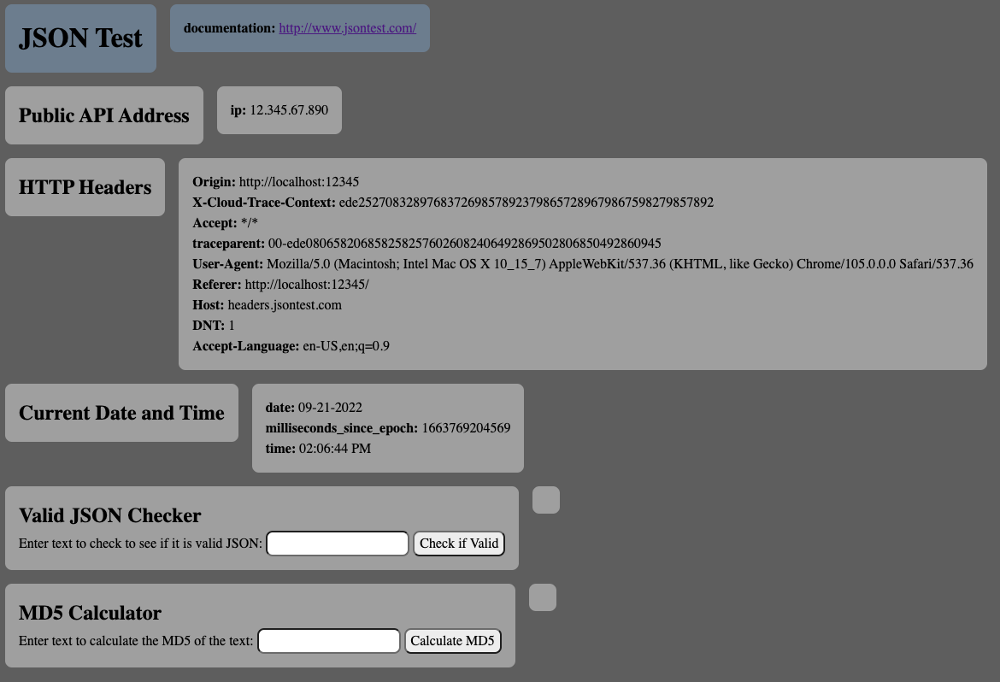

# JSON test Website

## Objective
Allow a user to view their public APi address, Http headers, and current date and time.
The user is also able to input text and check to see if it is valid JSON or calculate the md5 of the text.

Uses:
- Javascript
- Html
- Css

## Screenshot

